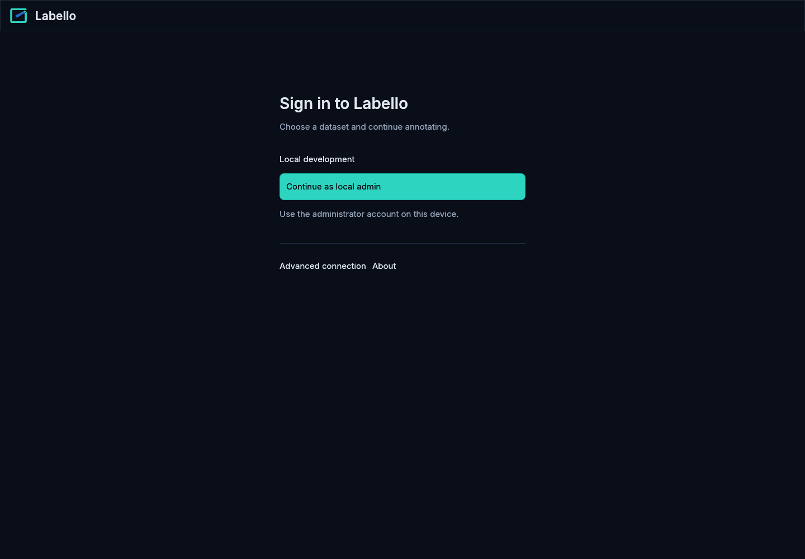
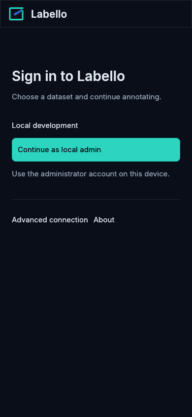
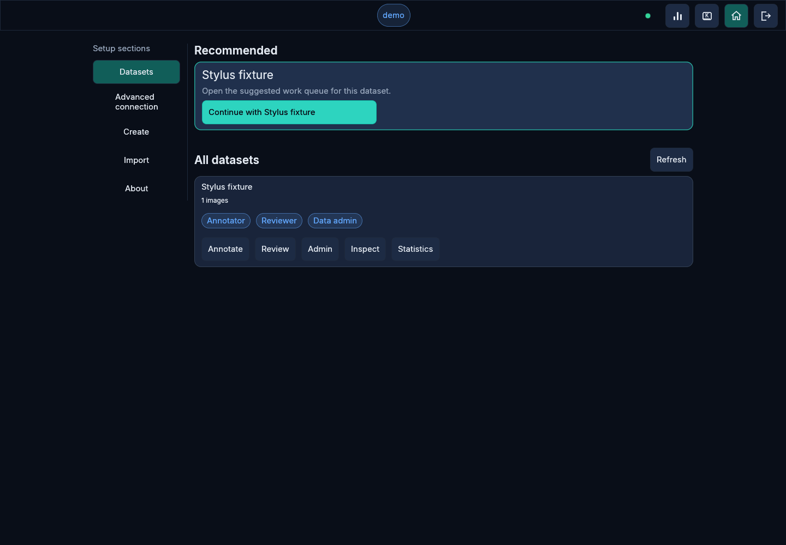
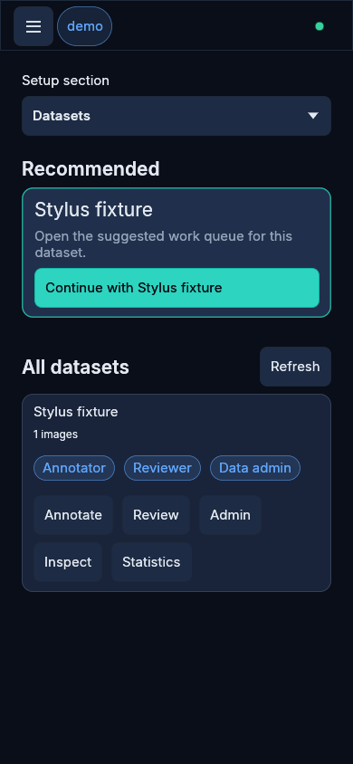

# Browser startup evidence

Before source: `bc557f1d025587592cdb01bacfdea4dcc7c5fd97`. After source: `18179da479ede5820f1389960afe19b26c61ca27`.
After captures came from the verified uncommitted diff subsequently committed as `18179da479ede5820f1389960afe19b26c61ca27`. Its source digest was `19192928f77e2957ceac9f3c37cb6937f7df5c3b9c476cc920e19fa4e52f3cd0`; per-file hashes and capture hashes are attached.

All captures are Firefox 151.0, Xvfb/Mesa software graphics, DPR 1 and 100% zoom. They use a disposable loopback server and synthetic fixture data. Local administrator login appears only in this development fixture. No cookies, credentials, image content, annotation geometry or runtime data are included.

The shared T3 preview failed to initialize its Electron renderer, so these captures use the Firefox harness already used for the audit. Chromium release behavior was verified separately.

## HTML loading placeholder before/after changing its font from downloaded Inter to the system font. The WASM response was held to capture this state.

Viewport 1440x1000 CSS pixels, DPR 1, 100% zoom. Before revision `bc557f1d025587592cdb01bacfdea4dcc7c5fd97`; after revision `18179da479ede5820f1389960afe19b26c61ca27`.

## Signed-out screen and app-bar icon before/after replacing runtime SVG rasterization with a bundled PNG.

Viewport 1440x1000 CSS pixels, DPR 1, 100% zoom. Before revision `bc557f1d025587592cdb01bacfdea4dcc7c5fd97`; after revision `18179da479ede5820f1389960afe19b26c61ca27`.

## Compact signed-out screen and app-bar icon.

Viewport 390x844 CSS pixels, DPR 1, 100% zoom. Before revision `bc557f1d025587592cdb01bacfdea4dcc7c5fd97`; after revision `18179da479ede5820f1389960afe19b26c61ca27`.

## Signed-in dataset list with recommended action and dataset roles. No image restoration is included in this state.

Viewport 1440x1000 CSS pixels, DPR 1, 100% zoom. Before revision `bc557f1d025587592cdb01bacfdea4dcc7c5fd97`; after revision `18179da479ede5820f1389960afe19b26c61ca27`.

## Compact signed-in dataset list with its dataset actions.

Viewport 390x844 CSS pixels, DPR 1, 100% zoom. Before revision `bc557f1d025587592cdb01bacfdea4dcc7c5fd97`; after revision `18179da479ede5820f1389960afe19b26c61ca27`.

## Performance limits

The endpoint is the first draw of the recommended dataset button at 1440x1000/DPR1, followed by an in-memory visibility check and an actual click that opens the dataset. Each run uses a fresh HTTP/browser context carrying only its disposable session, without a saved workspace preference. The browser process is reused; compiled-code caches are not claimed to be empty. Network shaping is 50 Mbps per static response and 40 ms per request, not a complete production network model.

Firefox dataset-list medians: original release 4382 ms across three contexts; optimized release 1228 ms across five contexts. Chromium optimized median 861.5 ms across five contexts. Unthrottled Firefox median 749 ms, max 1170 ms. The Firefox target remains unmet in the network model and consistent sub-second production loads have not been demonstrated.

WASM bytes: 19,277,536 originally delivered without compression; optimized raw 9,595,023 and Brotli 2,893,769. Production has not been changed. The optimized build requires WebAssembly SIMD.

Canonical `./scripts/verify.sh changed origin/main` passed against the before source SHA, including locked tests, formatting, Clippy, WASM checks and release Trunk build. UI results were 707 passed and two pre-existing ignored. Documentation local links and anchors passed.
